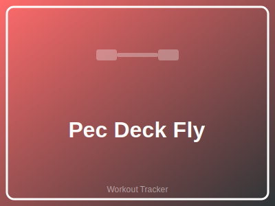

# Pec Deck Fly



## Setup

[Describe starting position and equipment setup]

## Execution

[Step-by-step movement instructions]

## Common Mistakes

- 
- 

## Safety Notes

-

## Related Exercises

{{#each related}}
- [[{{this}}]]
{{/each}}

## History

```dataview
table date, sets, notes
from "logs"
where exercise = "pec-deck-fly"
sort date desc
limit 10
```
